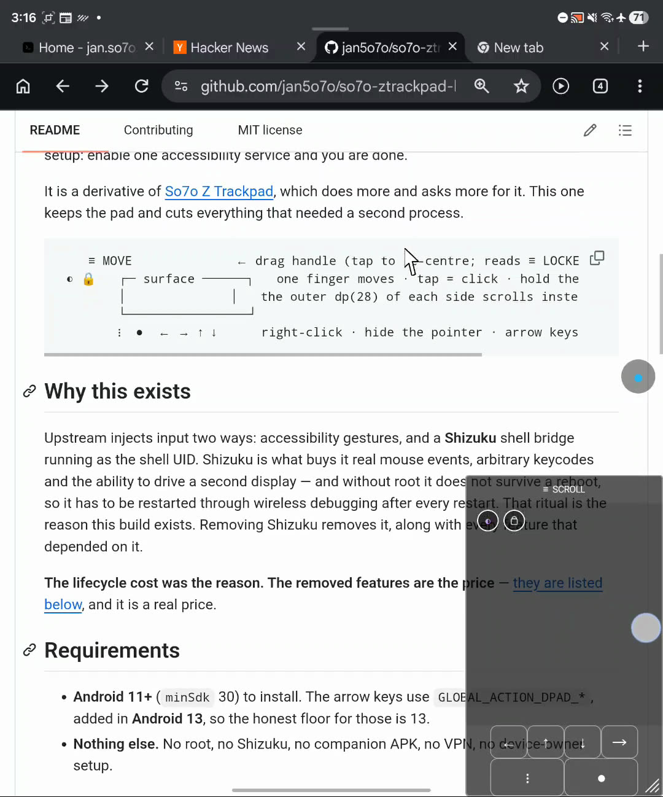
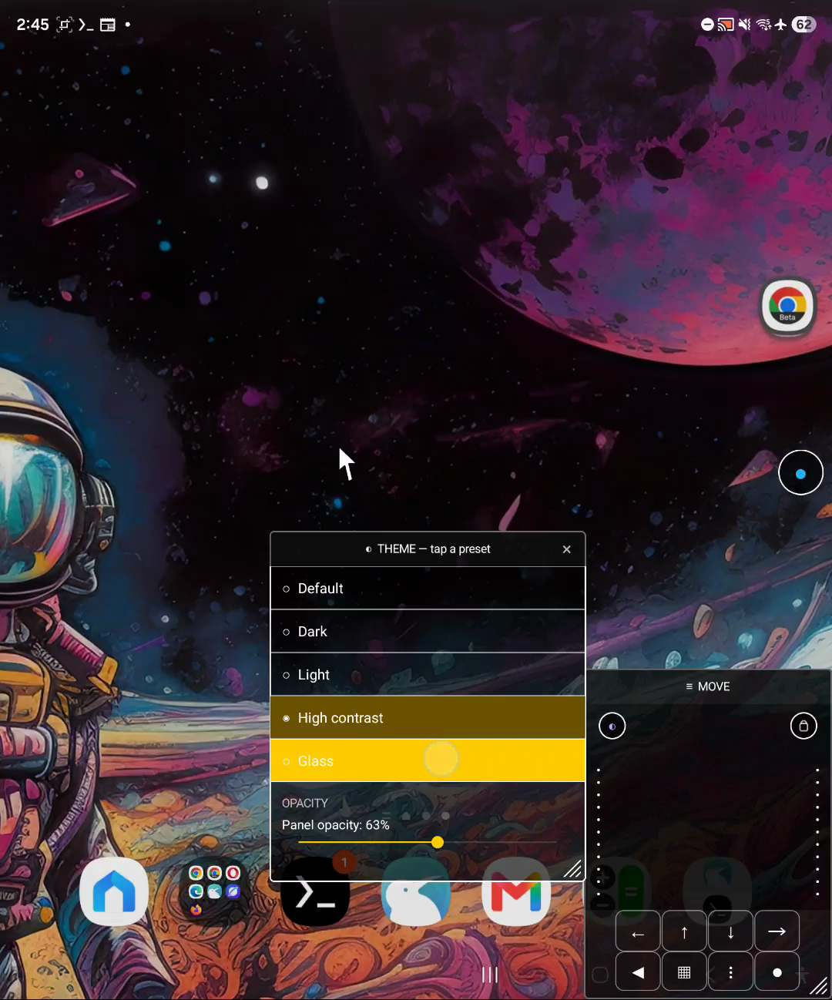

# So7o Z Trackpad Lite

A floating **trackpad and pointer** for Android, with **no root and no companion app**.
Nothing to install alongside it, nothing to restart after a reboot, no adb in the loop
after the first setup: enable one accessibility service and you are done.

It is a spin-off of [So7o Z Trackpad](https://github.com/jan5o7o/ztrackpad) — the same pad,
the same pointer, the same five themes, but built to need only one accessibility service and
nothing else.


*The pad and its theme menu. Scrolling lands when you lift your finger — see
[The honest limits](#the-honest-limits).*

▶ **[Full demo on YouTube](https://youtube.com/shorts/Vc9253FUyPU?feature=share)** — the whole
~1:45 walkthrough, pad and pointer over Chrome and Termux.

```
    ≡ MOVE              ← drag handle (tap to re-centre; reads ≡ LOCKED when locked)
 ◐     ┌─ surface ─────┐  🔒   one finger moves · tap = click · hold then move = drag
       │  ·         ·  │      the dotted columns mark each dp(28) scroll strip
       └──────────────┘
   ◀ ▦ ⋮ ●  ← → ↑ ↓    back · recents · right-click · hide pointer · arrow keys
```

## Why this

A trackpad for people who read a lot. The **edge scroll strips** are the point: flick your
finger down either edge and the page glides at a pace you set, instead of snapping to the
next screenful — so a long article scrolls slowly and steadily, exactly as fast as you read.
Two-finger drag scrolls too, and the pad follows the pointer wherever it goes, so you can
park it on the page's edge and keep reading without moving your hand.

It asks for one accessibility service, enabled once, and then survives reboots on its own.
Every click, long press, scroll and drag is an accessibility gesture — there is no second
process and no ritual after a restart. Turn it on and forget it.

## Requirements

- **Android 11+** (`minSdk` 30) to install. The arrow keys use
  `GLOBAL_ACTION_DPAD_*`, added in **Android 13**, so the honest floor for those is 13.
- **Nothing else.** No root, no companion APK, no VPN, no device-owner setup.

## Install

Grab `ztrackpad-lite.apk` from the [releases page](https://github.com/jan5o7o/so7o-ztrackpad-lite/releases)
(the latest release). It is a normal APK, not from the Play Store, so two Android guards
will try to stop you. Both are expected for any sideloaded app — this one is signed with
the maintainer's key and the source is right here in this repo.

- **Google Play Protect** will warn that it does not recognise the app, or that the file
  *may be harmful*. That is the standard message for an APK from outside the Play Store.
  Tap **Install anyway** (or **Download anyway** if the browser blocks the download).
  Play Protect stays on; it simply has no catalogue entry for this app.
- **Restricted settings** (Android 13+): an app installed from a browser download is
  treated as restricted, which locks its sensitive permissions — including the
  accessibility service. Until you lift that, the service toggle will not open. Go to
  **Settings → Apps → So7o Z Trackpad Lite → ⋮ (menu) → Allow restricted settings** and
  confirm. Google's own note: <https://support.google.com/android/answer/12623953>.

## Setup

1. Open the app and tap **Open Accessibility Settings** — the button is the first thing
   under the title, so a fresh install never has to scroll to find it. That button is the
   fast way back here too: it jumps straight to the accessibility screen whenever you want
   to flip the service on or off.
2. Enable **So7o Z Trackpad Lite** under *Installed services*.
3. Come back — a small `●` dot appears on screen. Tap it to show the pad.

That survives reboots. There is no step 4.

> **Do not enable two accessibility overlay services at once** — both draw overlays and
> inject input, and they will fight over the pointer.

## The controls

- **`●`** — the drawn dot. Tap to show or hide the trackpad; drag it and it snaps to the
  nearer vertical edge.
- **The pad**
  - **`≡ MOVE`** — the handle. Drag to move the pad; tap to re-centre. Reads `≡ LOCKED`
    when the lock is on, `≡ SCROLL` mid-scroll, `≡ DRAG ARMED` when a drag is armed.
  - **`◐`** and the **lock** — two round dots just below the handle, one per side of the
    pad's top: `◐` on the left opens the theme menu (five presets plus an opacity slider);
    the lock on the right freezes the pad's position and size and persists across restarts.
  - **The dotted columns** down each side of the surface mark the edge-scroll strips.
  - **Corners** — drag any corner to resize. Only the bottom-right one is drawn; the other
    three are live but invisible.
  - The button row: **`◀`** back, **`▦`** the running-apps switcher, **`⋮`** right-click at
    the pointer, **`●`** hide/show the pointer, and the four **arrow** keys. Back and
    recents go out as accessibility global actions — the same no-permission mechanism as
    the arrows.

## Gestures

| | |
|---|---|
| drag one finger | move the pointer |
| tap | click at the pointer — **through** the pad, if the pad is covering the target |
| hold still | long press |
| two-finger drag | scroll |
| swipe the left or right edge | scroll, like a laptop's strip |
| two-finger tap | right-click (as a long press) |
| tap, then touch again within 300ms | arm a press-and-drag |

**Scrolling lands when you lift your finger**, not while it moves. That is not a bug to
report: an injected gesture cannot run while a real touch is in progress, so the distance is
accumulated and spent on release. It is the ceiling for an app with no second process to
inject through.

## Scripting it

The pad's state can be read and driven over a broadcast, which is also how the test suite
checks it:

```bash
adb shell am broadcast -n app.so7o.ztrackpad.lite/.ControlReceiver \
    -a app.so7o.ztrackpad.lite.CONTROL --es op status
```

| op | arg | reply |
|---|---|---|
| `status` | — | `padlocked=false pad=shown theme=default w=1812 h=2176` |
| `lock` | `on` \| `off` \| `toggle` | `ok lock <status>` |
| `theme` | a preset id, or nothing to read it | `ok theme contrast` |

The `-n` component is **mandatory**. An implicit broadcast does not reach a manifest-declared
receiver on API 26+, and the failure is silent.

## Build

No Gradle, no Kotlin, no SDK install — plain Java, built with `aapt2`, `javac`, `d8` and
`apksigner`:

```bash
./build.sh                      # -> out/ztrackpad-lite.apk
adb install -r out/ztrackpad-lite.apk
tests/smoke.sh                  # device checks that need no fingers
```

Signing needs a keystore password: set `KSPASS`, or keep it in `~/.ztrackpad-lite-kspass`.
The build fails closed without it. `sdk/platforms/android-36/android.jar` is gitignored —
restore it from the platform archive before the first build.

## In use

Driving a page in Chrome — the pad sits down the right edge and the pointer clicks whatever is
under it, including the pad's own footprint:



The theme and opacity menu, opened from the `◐` dot under the handle:



## The honest limits

Click, long press, scroll and drag are all sent as accessibility gestures. That is what makes
the app dependency-free, and it is also its cost:

- **No hover**, and no way to hide the system pointer if one is present.
- **The drag is approximate** — built from continued strokes with a heartbeat that restarts
  the chain when the platform cancels it. If drag ever feels like it stalls mid-press, that
  is why.
- **No right-click proper.** Two-finger tap becomes a long press.

## Licence

MIT — see [LICENSE](LICENSE). Third-party terms are in
[THIRD_PARTY_LICENSES.md](THIRD_PARTY_LICENSES.md).
